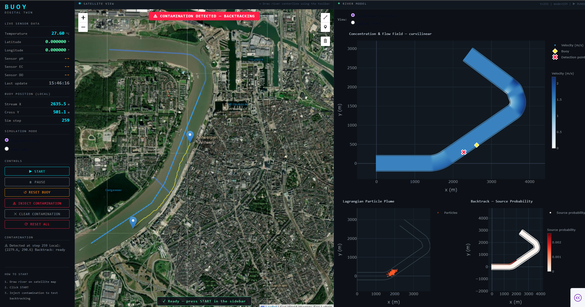

# Buoy Digital Twin



## Project Structure

```
project_bouy_dt/
├── app.py                      ← Entry point
├── config.py                   ← Credentials & tuning constants
├── requirements.txt
│
├── core/
│   ├── river_model.py          ← River, LagrangianParticles, DVsolver
│   ├── river_config.py
│   ├── georef.py               ← GPS ↔ local coordinate transforms
│   ├── estimator.py
│   ├── simulation.py           ← Physics state machine
│   ├── global_buoy_dt.py
│   └── buoy_dt/
│       ├── buoy_comm.py        ← ThingsBoard HTTP client
│       ├── buoy_controller.py
│       ├── buoy_models.py
│       └── buoy_sensor.py
│
├── components/
│   ├── control_panel.py        ← Left sidebar
│   ├── map_panel.py            ← Satellite map (dash-leaflet)
│   └── river_panel.py          ← River model plots (plotly)
│
├── river_presets/              ← Saved river configurations (JSON)
└── CPS_Buoy_Walter/
|    └── CPS_Buoy_Walter.ino    ← Arduino firmware
|
|
├── CPS Portfolio.zip           ← Portfolio (overview of project & architectur, final presentation)
```

## Setup

```bash
pip install -r requirements.txt
```

Edit `config.py`:
| Key | Description |
|-----|-------------|
| `TB_EMAIL` / `TB_PASSWORD` | ThingsBoard login |
| `TB_DEVICE_ID` | UUID from your device URL |
| `MAP_DEFAULT_LAT/LON` | Map centre (default: Antwerp / Schelde) |

**Expected ThingsBoard telemetry keys:** `gps` (`lat`, `lon`, `sn`, `se`), `ph`, `ec`, `do`, `temperature`, IMU (`ax`, `ay`, `az`, `gx`, `gy`, `gz`, `mx`, `my`, `mz`)

## Run

```bash
python app.py
```
→ Open [http://localhost:8050](http://localhost:8050)

## How to use

A default river is pre-loaded. Redraw as needed using the **Toolbar**.

1. **Redraw the river centreline** (optional — default is pre-loaded)
2. **Redraw the river width** bank-to-bank (optional)
3. **Place SOURCE (sim) and BUOY START** on the map
4. Click **▶ START**
5. After the buoy drifts through the plume → click **ESTIMATE SOURCE**
6. Reposition buoy start and run again to sharpen the estimate
7. Runs and river segments can be saved by entering a name and clicking **SAVE**

> For bends, draw in short segments (~200 m) with >2° angle between them, they'll be auto-merged into a smooth bend.
